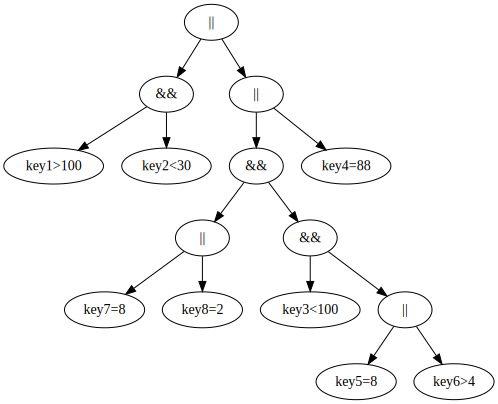

# 文法
```
or     ::= and || or
and    ::= simple && and
simple ::= a > b
         |(or)
```

# 解析
采用递归下降算法（Recursive Descent）解析

# 使用
```java
public class AlertRuleInterpreterTest {
    public static void main(String[] args) {
        String rule = "key1 > 100 && key2 < 30 || ((key7 = 8 || key8 =2) " +
                "&& key3 < 100 && (key5 = 8 || key6 > 4)) || key4 = 88";
        
        AlertRuleInterpreter alertRuleInterpreter = new AlertRuleInterpreter(
                rule.replaceAll("\\s",""));
        Map<String, Long> stats = new HashMap<>();
        stats.put("key1", 101L);
        stats.put("key2", 101L);
        stats.put("key3", 121L);
        stats.put("key4", 78L);
        stats.put("key5", 38L);
        stats.put("key6", 88L);
        
        boolean alert = alertRuleInterpreter.interpret(stats);
        // 生成 graphviz 图
        System.out.println(alertRuleInterpreter.toGraphViz());
        System.out.println(alert);
    }
}

```
## Graphviz 图
```
digraph AlertRuleInterpreter {
   14[label="||"];
   14->2;
   14->13;
   2[label="&&"];
   2->0;
   2->1;
   0 [label="key1>100"];
   1 [label="key2<30"];
   13[label="||"];
   13->11;
   13->12;
   11[label="&&"];
   11->5;
   11->10;
   5[label="||"];
   5->3;
   5->4;
   3 [label="key7=8"];
   4 [label="key8=2"];
   10[label="&&"];
   10->6;
   10->9;
   6 [label="key3<100"];
   9[label="||"];
   9->7;
   9->8;
   7 [label="key5=8"];
   8 [label="key6>4"];
   12 [label="key4=88"];
}
```

